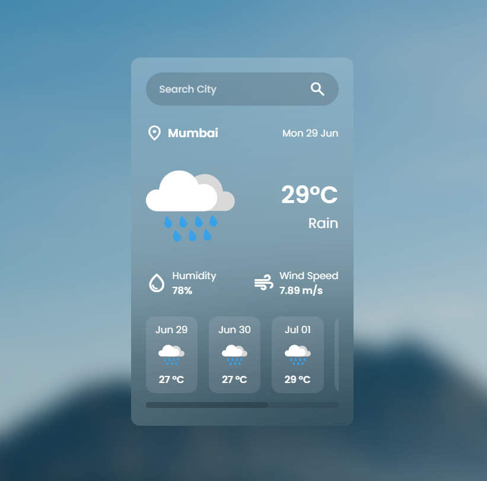

# 🌤️ Weather App

A modern and responsive weather application that provides real-time weather information for any city using a weather API. Users can search for locations and instantly view current weather conditions, including temperature, humidity, wind speed, and more.

🔗 https://alinasar-dev.github.io/weather-app/

## ✨ Features

- 🌍 Search weather by city name
- 🌡️ Real-time temperature display
- ☁️ 5-day weather forecast
- 💧 Humidity & Wind speed information
- 📱 Fully responsive design
- ⚡ Fast and lightweight interface

<p align="center">
  
</p>

---

## 🛠️ Built With

- HTML5
- CSS3
- JavaScript (ES6)
- Weather API (OpenWeatherMap / WeatherAPI)
- Fetch API

---

## 📂 Project Structure

```
weather-app/
│── index.html
│── style.css
│── script.js
│── assets/
│── README.md
```

---

## ⚙️ Installation

Clone the repository

```bash
git clone https://github.com/alinasar-dev/weather-app.git
```

Go to the project directory

```bash
cd weather-app
```

If you're using an API key, replace it inside `script.js`.

Then simply open `index.html` in your browser.

---

## 🔑 API Setup

If your project uses **OpenWeatherMap**:

1. Create an account at https://openweathermap.org/
2. Generate an API key.
3. Replace the placeholder API key in your JavaScript file.

Example:

```javascript
const API_KEY = "YOUR_API_KEY";
```

---

## 📖 Usage

1. Enter the name of a city.
2. Press **Search**.
3. View the current weather information instantly.

---

## 🎯 Future Improvements

- Current location support
- Dark mode
- Weather maps

---

## 👨‍💻 Author

**Ali Nasar**

- GitHub: https://github.com/alinasar-dev
- **Credits:** Special thanks to **CodeArry** for the excellent tutorial and guidance.
---
